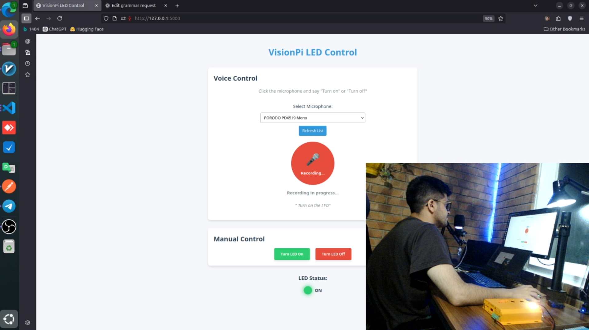
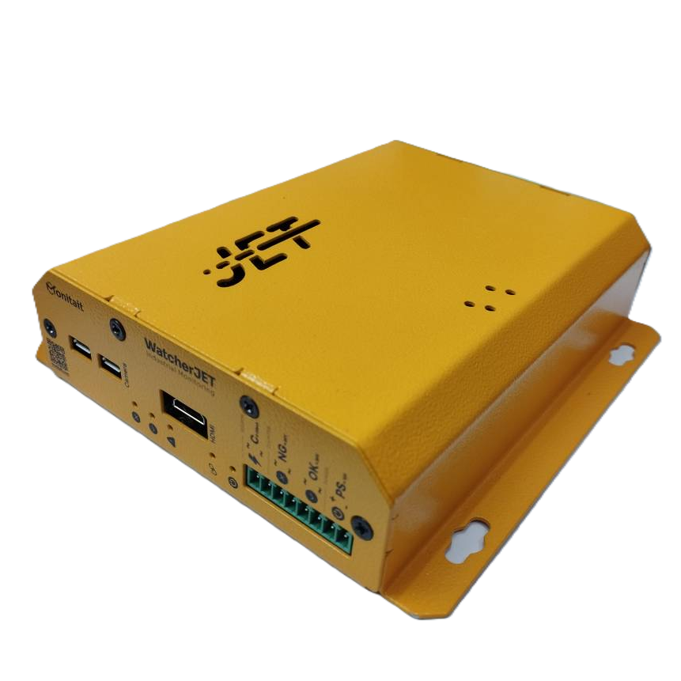
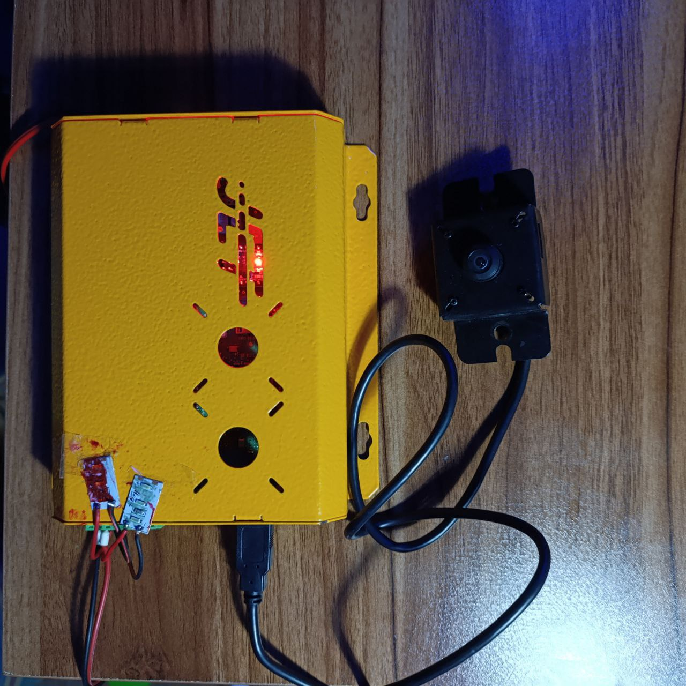
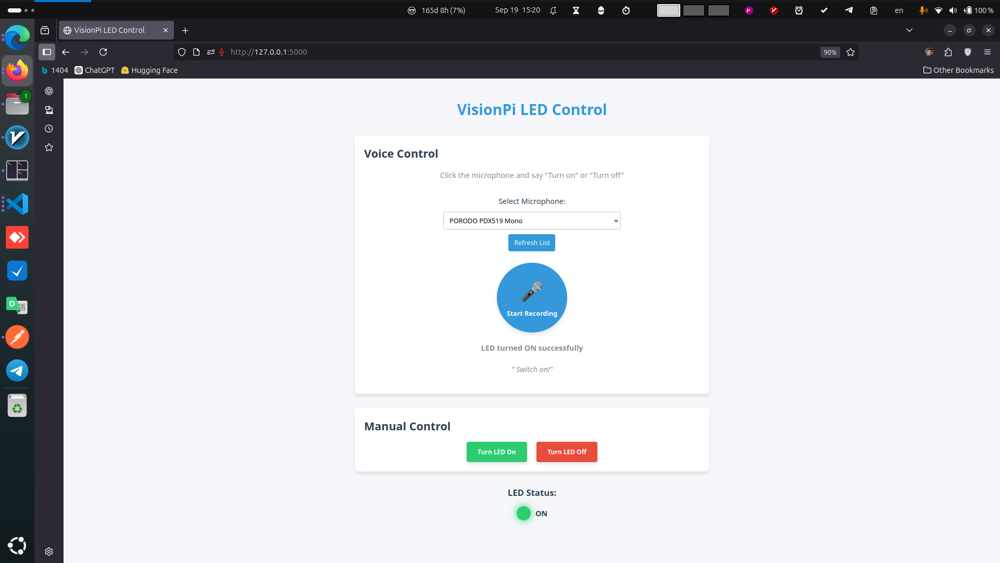
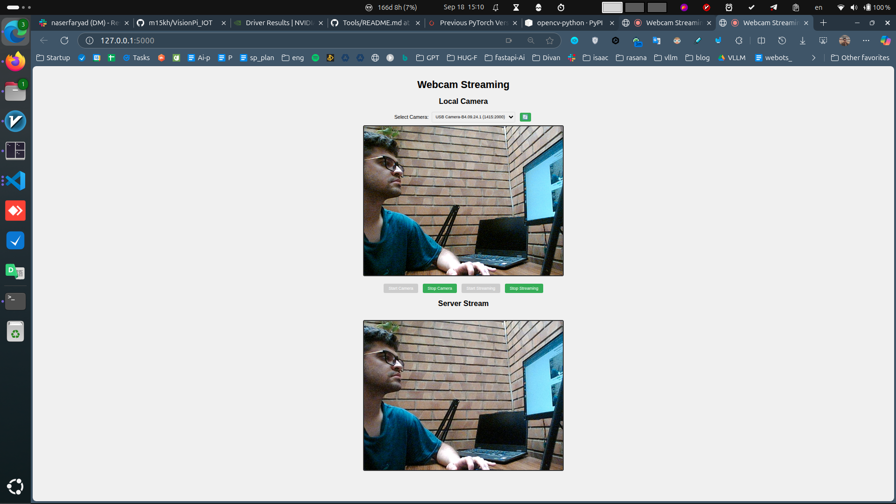

# Smart Lamp and Temperature Control System

*Smart IoT system utilizing Raspberry Pi 4, Arduino Nano, and AI models for voice and vision processing*

This project implements a **smart lamp and temperature control system** using **Raspberry Pi 4, Arduino Nano, Whisper, LLM (Large Language Model), and VLM (Vision-Language Model)**. The system can process voice commands and control the state of a lamp and temperature based on sensor data and visual input from a camera.

## Demonstration

[](assets/demo.mp4)

*Video demonstration of the system responding to voice commands and adjusting the lamp and temperature*


*Camera view from the system's watcher module during operation*







---

## Features

* **Voice Command Recognition** using **Whisper** (speech-to-text).
* **Multimodal Input Processing** with **Vision-Language Models (VLM)**.
* **Lamp and Temperature Control** via **Arduino Nano** and **Raspberry Pi**.
* Real-time processing of voice commands and image data.
* **HTTP** and **WebSocket** communication protocols for sending and receiving data.

---

## Prerequisites

To run this project, the following prerequisites are needed:

* **Raspberry Pi 4** or a similar board with GPIO support.
* **Arduino IDE** for programming the **Arduino Nano** board.
* **Python 3.x** and required libraries:

  * `fastapi`
  * `flask`
  * `requests`
  * `opencv-python`
  * `pyaudio`
  * `whisper` (for speech-to-text)
  * `torch` (for LLM and VLM models)
* **Microphone and Camera** for audio and visual input.

*Physical setup of Raspberry Pi with camera, microphone, and Arduino Nano*

---

## Installation and Setup

1. **Raspberry Pi Setup**:

   * Install **Raspberry Pi OS** on the SD card.
   * Connect to the internet and update the system:

     ```bash
     sudo apt-get update && sudo apt-get upgrade
     ```
   * Install Python 3 and necessary libraries:

     ```bash
     sudo apt-get install python3-pip
     pip3 install fastapi flask opencv-python torch pyaudio whisper requests
     ```

2. **Arduino Nano Setup**:

   * Connect the **Arduino Nano** to your computer.
   * Install the **Arduino IDE** and upload the control code for the lamp and temperature sensor.

   *Arduino Nano connected to lamp and temperature sensor*

3. **Server Setup**:

   * If using a server for data processing, ensure that **Whisper**, **LLM**, and **VLM** models are installed on the server. PyTorch and pretrained models are required.
   * The server will use **FastAPI** to manage communications between Raspberry Pi and the server for processing data.

---

## Usage

1. **Running the Server**:

   * After setting up all dependencies, run the server using the following command:

   ```bash
   uvicorn main:app --reload
   ```

   * This command runs FastAPI locally on port 8000.

2. **Running on Raspberry Pi**:

   * After starting the server, execute the Raspberry Pi code to begin listening for voice commands via **Whisper**.
   * Video data is sent to the server for processing and lamp control commands are sent to the **Arduino Nano** for execution.

   *Screenshot of the system's interface during operation*

---

## How the System Works

1. **Voice Command Reception**:

   * The user speaks a command such as "Turn off the light."
   * The Whisper model converts the voice command into text and sends it to the server.

2. **Data Processing**:

   * The **LLM** model analyzes the text and determines the appropriate action (turning the lamp on or off).
   * The **VLM** model processes camera input to detect any relevant objects, people, or abnormal behavior.

3. **Execution of Commands**:

   * Once the processing is complete, the server sends the appropriate command to **Raspberry Pi**.
   * Raspberry Pi communicates with **Arduino Nano** to turn the lamp on or off.

*Diagram illustrating the flow of data through the system*

---

## Challenges and Limitations

* **Dependency on Network**: Communication between Raspberry Pi and the server may face issues if the internet connection is unstable.
* **ASR Accuracy**: Whisper's performance may degrade in noisy environments.
* **Heavy Processing**: Running heavy models like **VLM** requires significant resources, making powerful hardware necessary for real-time processing.

---

## Future Developments

* Support for **multiple simultaneous voice commands**.
* Improvement in **speech recognition** accuracy in noisy environments.
* Adding **more complex abnormal behavior detection** (e.g., identifying people with different attire).
* **Energy optimization** for longer battery life when operating off-grid.
* **Mobile app integration** for remote monitoring and control.
* **Expanded sensor suite** for environmental monitoring beyond temperature.

---


